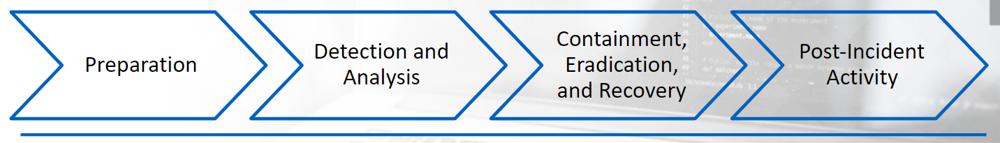

# Incident Response Process? 
Defined by 4 steps: 
1. Preparation
2. Detection and Analysis
3. Containment, Eradication, and Recovery
4. Post-Incident Activity

## Preparation
Involves preparing your organization to handle incidents and involves:
- Outlining everyones' responsibilities, hardware, tools, documentation, etc. 
- Taking steps to reduce the probability of an incident from ever occuring

Incident: defined as a violation or imminent threat of violation of computer security policies, acceptable use policies, or standard security practices. 

## Detection and Analysis
In this phase, the IR team would confirm if a breach took place. 

They would analyze all the symptoms which were reported and confirm if the situration would be classified as an incident.

## Containment, Eradication, and Recovery
IR team would gather intel and create signatures that will aid them in identifying each compromised system. 

With this information, countermeasures can be put in place to neutralize the attacker and attempt to restore systesm/data back to normal. 

## Post-Incident Activity
A "lesson learned" phase. 

Goal is to improve overall secrutiy posture of the organization and to assure that a similar incident will not happen again. 