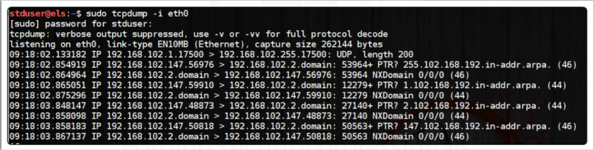

# tcpdump

tcpdump is a powerful packet sniffer that works on unix-based systems. 

It allows the user to intercept and display TCP/IP and other packets being transmitted or received over the network. 

tcpdump syntax:

Example:

-i indicates the interface to be monitered. 

Output: 
