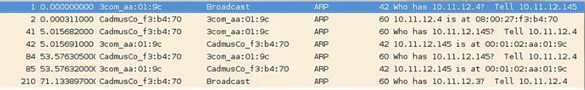

# ARP Traffic

When a host (A) wnats to send traffic to another (B), and it only knows the IP address of B:
1. A builds an ARP request containing the IP address of B and FF:FF:FF:FF:FF:FF as the destination MAC address; this is fundamental because the switches will forward the packet to every host.
2. Every host on the network will recieve the request.
3. B replies with an ARP reply, telling A its MAC address. 

