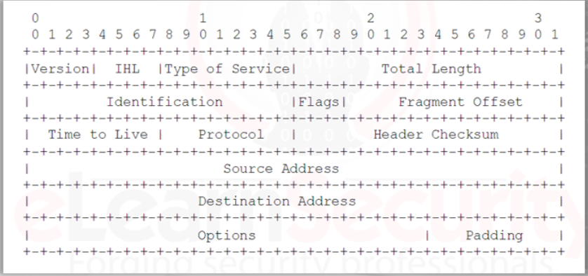

# Networking

Understanding how hosts communicate and how they communicate within an environment is important because: 
1. Hunters need to know/understand the TCP/IP stack and normal network communication within the guides of the protocol. With this knowledge it will help to spot something out of the ordinary. 
2. Hunters also need to know/understand what a normal network communication is within the organization. 
- Ex: a forgotten workstation within the network sending data to an outside vender via FTP every Saturday at midnight

A Threat Hunter should know/be familiar with the following: 
- TCP/IP protocol stack and how it works
- Port numbers and typical applications that use those ports
- the normal behavior of typical applications as they transmit data through the corporate network

## TCP/IP and Networking

Packets are broken up at the source host and they are reconstructed at the receiving host.
Packets contain a header which is followed by the payload. 

Example: The IP protocol header is at least 160 bits (20 bytes) long, and it includes information to interpret the content of the IP packet. 

The payload is the actual information to be sent to the destination host. 
This information can be part of an email or part of a file being downloaded/uploaded. 

Understanding the structure of packets will aid the hunter when analyzing large packet captures. 
The hunter can search specific fields within the packet to narrow down the search or alert the hunter when the search criteria is met during a live capture. 

