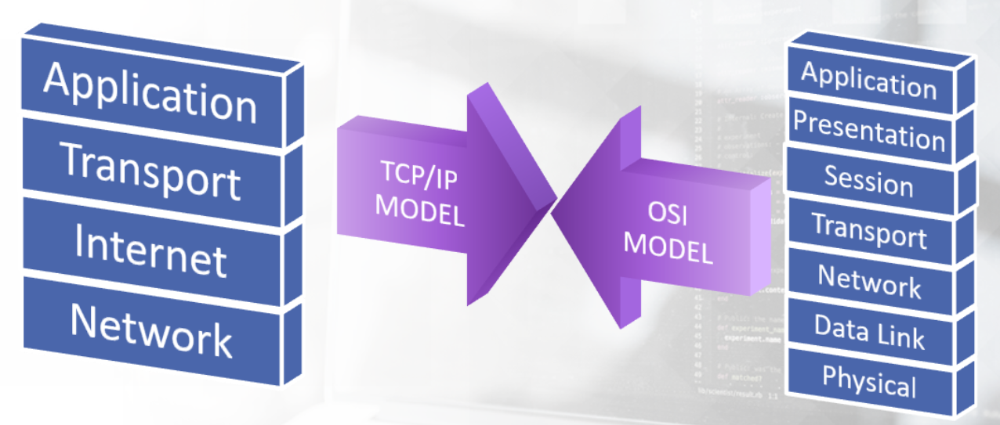

# OSI and TCP/IP Model

The OSI Model consists of 7 layers and is used as a reference for the implementation of actual protocols.

TCP/IP Model consist of only 4 layers, but they mesh together even though its fewer layers. See below. 

Different protocols operate at different layers of the TCP/IP Model:
- Application layer: FTP, SMTP, DNS, SNMP
- Transport layer: TCP, UDP
- Internet layer: IP, ARP, ICMP
- Network layer: Ethernet, Token Ring, Frame Relay

As packets are broken up to be prepared to be sent to the desting host, each layer of the models will perform encapsulation. 

During encapsulation, every protocol adds a header to the packet, treating it as a payload; this happens to every packet. 

At the destination host, which is receiving the packets, this process is done as well but in reverse order. 

The Internet Protocol (IP) is the protocol that runs on the Internet layer of TCP/IP Model. 
IP is responsible for delivering the datagrams(IP packets) to the hosts involved in communication and uses IP addresses to identify a host. 