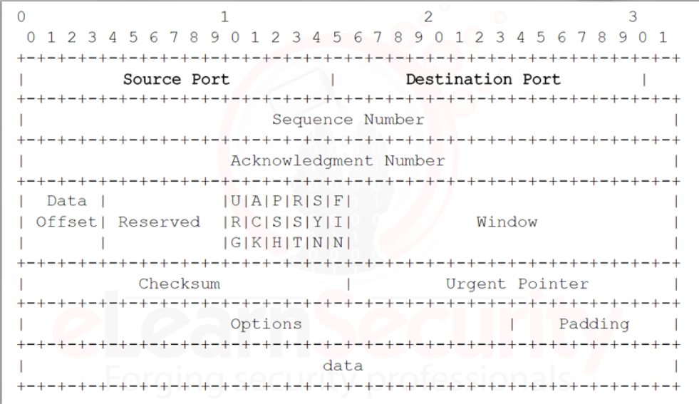
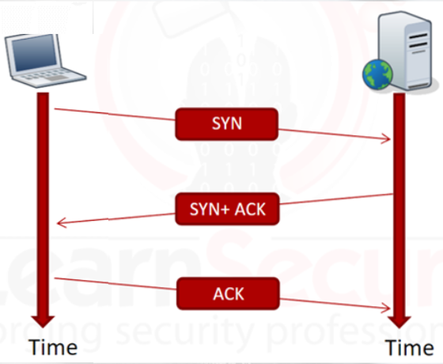
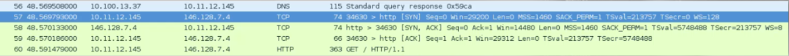

# TCP Traffic

TCP uses a 3-way handshake to establish communication between two hosts because the protocol is connection-orientated. 

Example TCP Header:

The header fields involved in the handshake are:
- Sequence number
- Acknowledgment number
- SYN and ACK flags

The steps in the handshake are used to synchronize the sequence and acknowledgment numbers between the server and the client. 

3-Way Handshake through Wireshark: 

