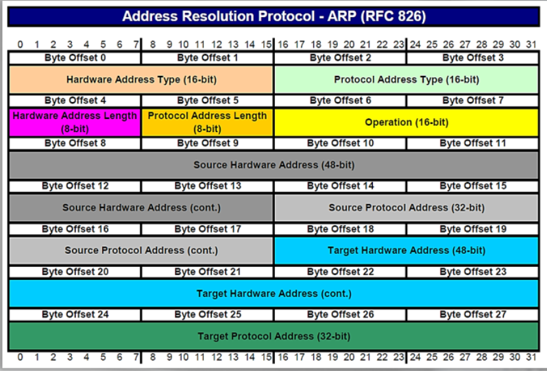
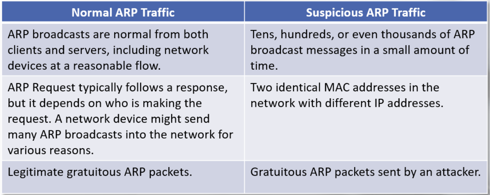

# ARP (Address Resolution Protocol)

ARP is a L2 protocol which is sued by IP to map IP addresses to MAC addresses. 

ARP messages involve a REQUEST message and a RESPONSE message. 

The message header is completed with one of the following operation codes:
- Request(1)
- Reply(2)

https://www.ietf.org/rfc/rfc826.txt

ARP packet structure:

Facts to help distinguish normal and suspicious ARP traffic: 

An attacker can manipulate other hosts' ARP cache tables by sending gratuitous ARP replies. 
Gratuitous ARP replies are unsolicited ARP Reply messages. 

The attacker can send an ARP Reply without waiting for a host to perform an ARP Request. 
The ARP cache table can then contain fake information and the attacker can send gratuitous ARP replies every 30 seconds or so to prevent the poisoned entry from expiring. 

