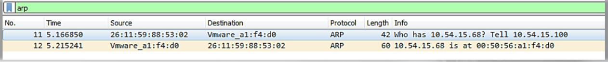
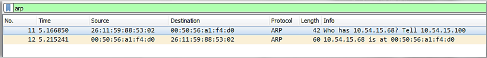
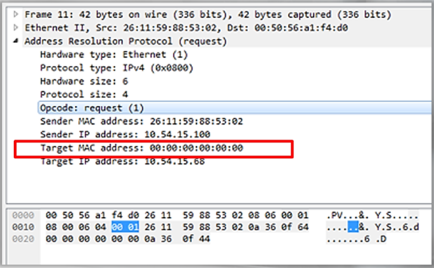
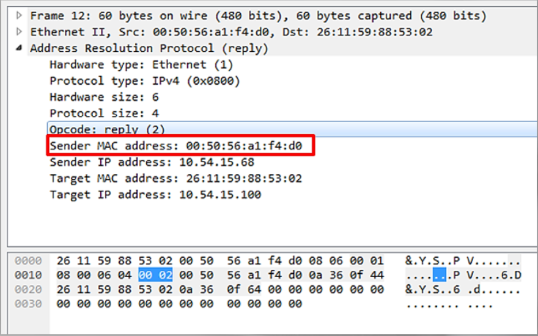
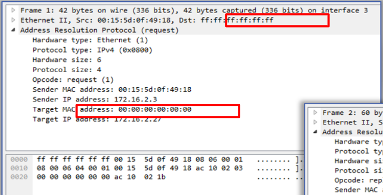
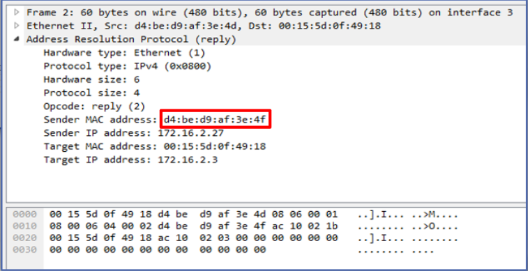

# Normal ARP

2 packets: 1 ARP Request and 1 ARP Reply


To see the MAC Address for both the source and destination: 
```
View > Name Resolution > Resolve Physical Addresses
```


Here we see an ARP Request packet. 
We know it's an ARP Request by the Opcode, request(1) in the highlighted line:


The device at 10.54.15.100 needs the MAC address for 10.54.15.68 to begin to establish communication with it. 

In this packet we have the reply to the previous packet:


This packet is the ARP Reply packet. 
We can tell by the Opcode, reply (2). 
We see that the Sender MAC address has been populated with the MAC address of the device at 10.54.15.68.
This MAC address will be added to the ARP table of 10.54.15.100. 

The following packets reflect an ARP Request within a network using a broadcast address as the destination:



