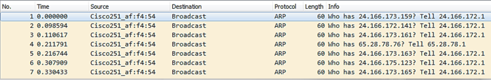
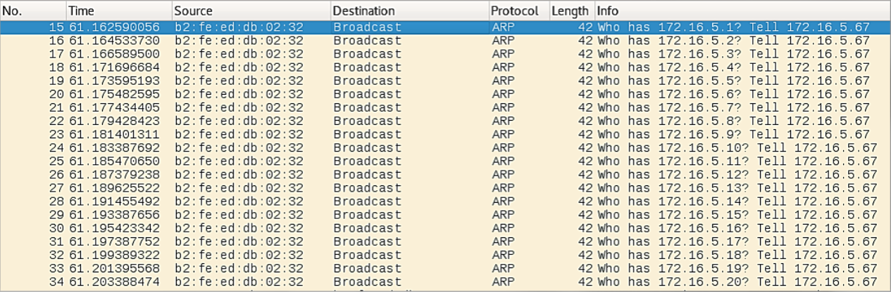

# Suspicious ARP

- Normal: ARP broadcasts are normal from both clients and servers, including network devices at a reasonoble flow. 
- Suspicious: Tens, hundreds, or even thousands of ARP broadcast messages in a small amount of time. 

The following shows 7 ARP Request packets sent via broadcast:

The source device is a Cisco device and it is checing on the stus of various devices on the network. 
Is this normal? Is this suspicous?
- Is it a configuration issue within the Cisco device or is it normal behavior?
- Do you have Cisco equipment in the network? 

Review this: 

This is suspicious.
The IP addresses increment by 1 and time intervals between packets are relatively small which indicate a scan is being conducted. 

https://www.wireshark.org/docs/dfref/a/arp.html