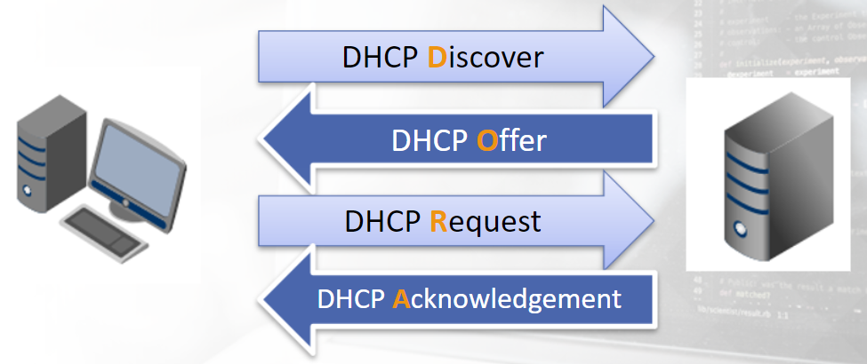
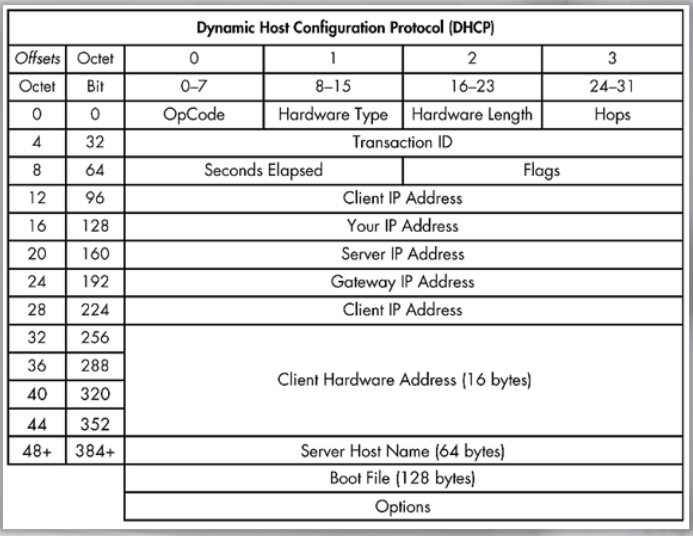

# DHCP (Dynamic Host Configuration Protocol)

DHCP automatically assigns an IP address to every node on a network and allows the devices to communicate with other devices within and outside the internal network using IP-based routing. 

- it automatically assigns IP addresses
- also provides other information, such as DNS server(s), Gateway, etc
- the DORA process is used (DHCP Discover, DHCP Offer, DHCP Request, DHCP Acknowledgement)
- uses UDP, Ports 67 and 68

DORA:

DHCP Packet Header:

