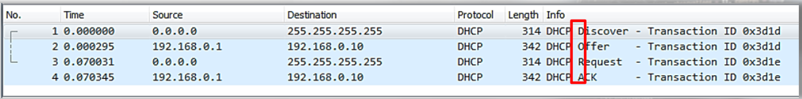
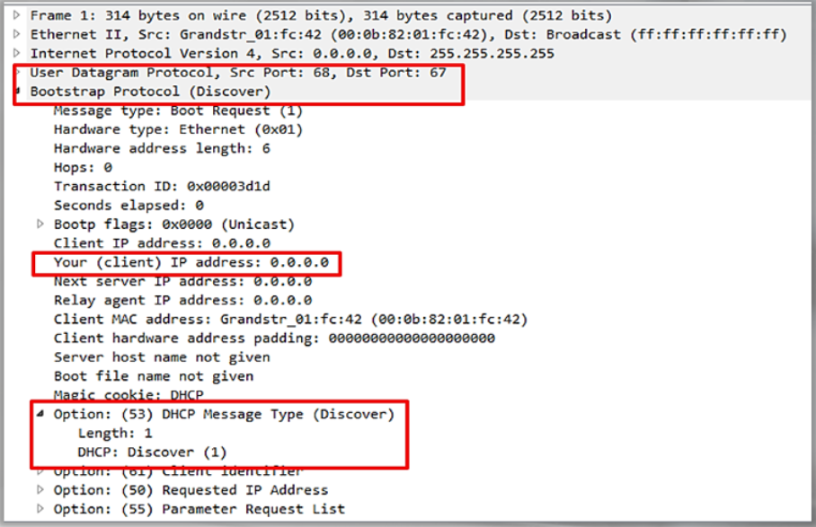
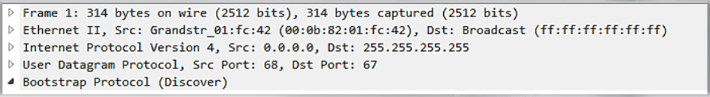
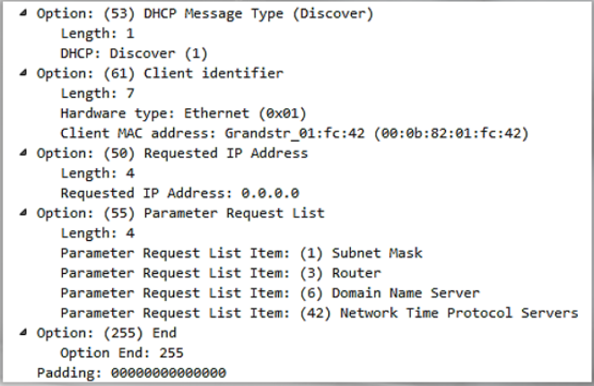
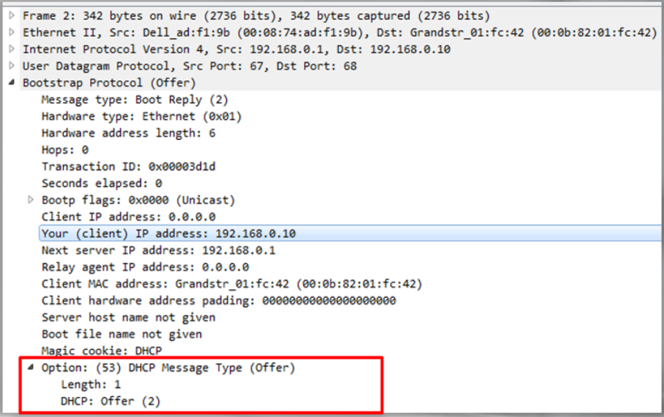
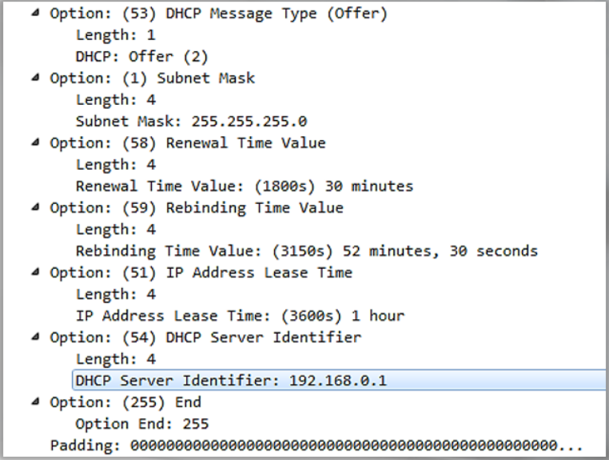
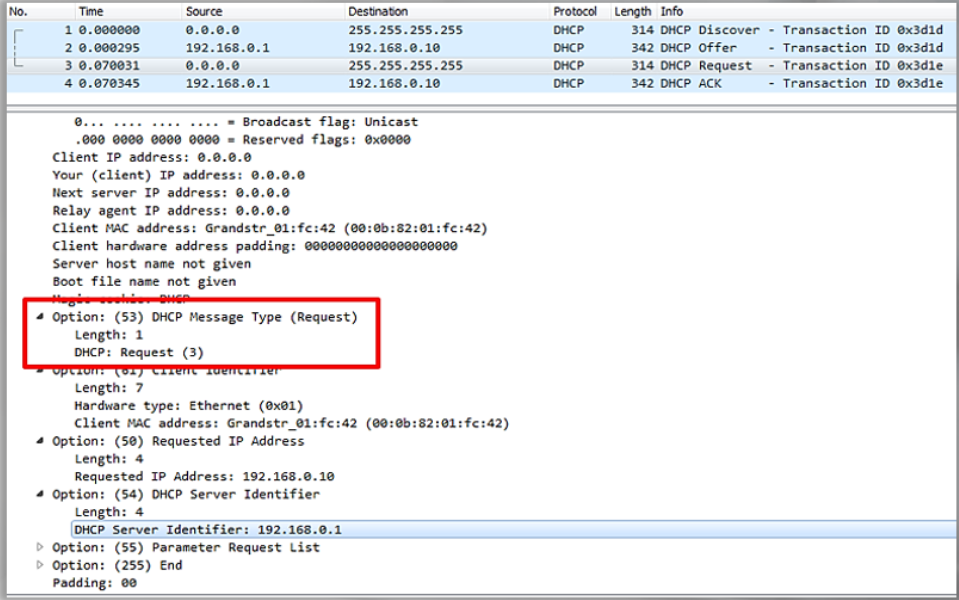
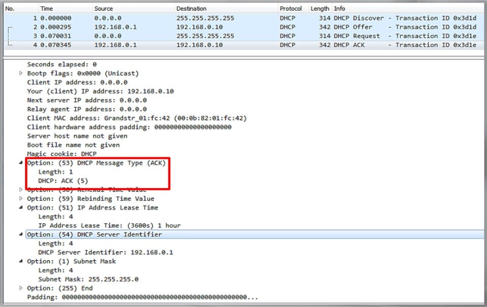

# Normal DHCP

DORA packets:

DHCP Discover packet: 

DHCP Offer packet:

The DHCP server is offering an IP address to the node which requested it. 

Example of Normal DHCP traffic: 

DHCP Request packet:

DHCP Ack packet:

