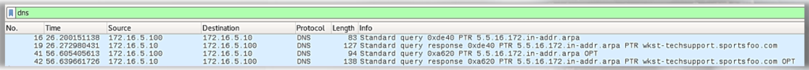
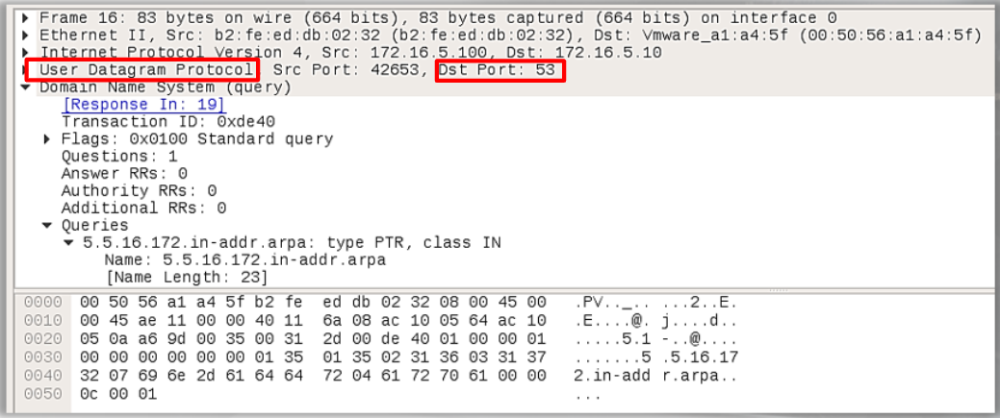
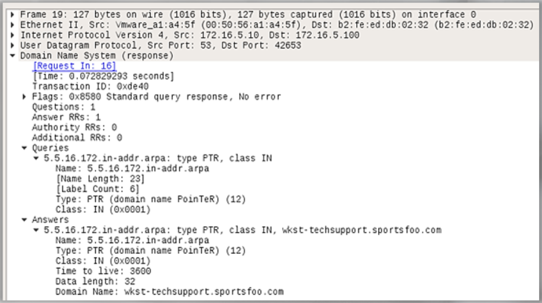
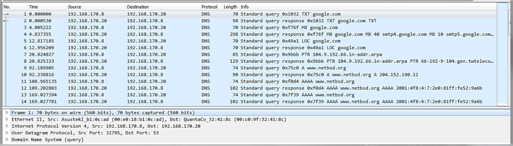

# Normal DNS

4 packets - 2 packets for DNS Queries and 2 for DNS Responses:

There are 2 different transaction IDs for the packets: 0xde40 & 0xa620

Below is a UDP packet and it's using an expected port, 53:

This is the DNS Response to the DNS Query in packet 16:

Packet capture displaying various DNS queries, but you can see the pattern of the DNS Query followed by the DNS Response:

