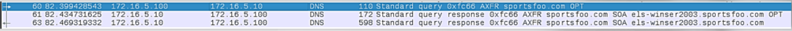
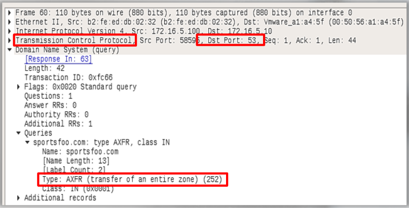
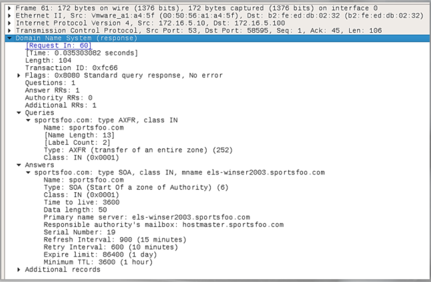

# Suspicious DNS

- Normal: Port 53, UDP
- Suspicious: Traffic on port 53 but using TCP instead of UDP

3 packets which all share 1 transaction: 

We see AXFR, which let's us know that this DNS Query is pertaining to a DNS Zone Transfer.

Details of packet 60:

- instead of using UDP/53, this DNS query used TCP/53
- why use TCP instead of UDP? 
    - occurs when the response to a DNS query is too large to fit within a single UDP packet
    - the query is resubmitted via TCP to retrieve the entire contents of the response

Response to the DNS query:

DNS over TCP should be considered suspicious.

If your org is not blocking TCP/53, then it should at least be monitored; this can potentially hide malicious traffic in plain sight. 

DNS tunnels is another technique in which DNS can be used for nefarious purposes. 