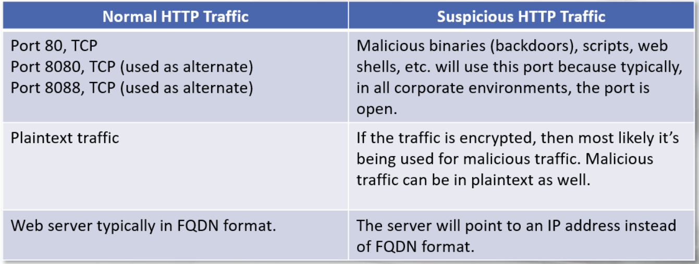

# HTTP

- HTTP traffic consists of a series of requests and responses known as messages
    - the client will make a request and the server will respond
    - HTTP resonses include a 3-digit status code
- HTTP messages include a message header and body
- HTTP uses methods to perform various operations

Facts to help distinguish normal and suspicious HTTP traffic:

