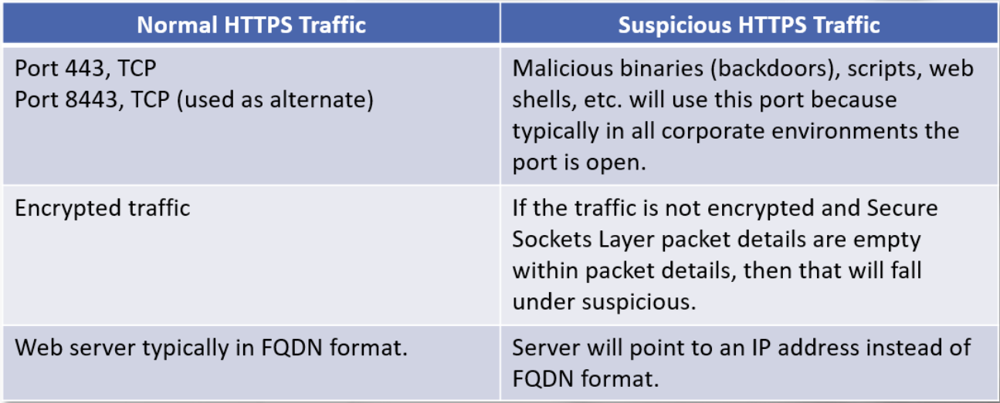

# HTTPS

HTTPS is the secure viersion of HTTP. 

The 'S' refers to Secure Socket Layer/Transport Layer Security (SSL/TLS).

HTTPS also establishes a handshake similar to TCP but more complex:
- both the client and the server need to agree on the protocol version
- both the client and the server need to select cryptographic algorithms
- optionally, the client and server authenticate to each other
- uses public key encryption techniques to establish secure communications

Facts to help distinguish normal and suspicious HTTPS traffic: 

