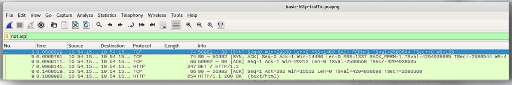
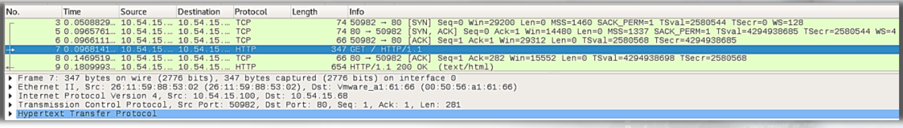
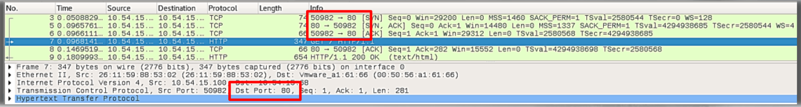
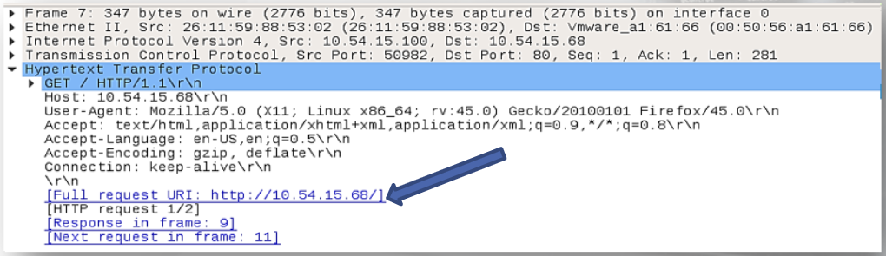

# Normal HTTP

- 6 packets (4 relating to tcp and 2 on http)
- packets 3-6 is the TCP Handshake - http relies on TCP for reliability
- packet 7 we notice an HTTP method (GET)
- packet 9 we see an HTTP resonse code (200 OK)

Packet information as it pertains to the different layers of the OSI model:
- Ethernet II = MAC Addresses (SRC, DST)
- Internet Protocol Version 4 = IP Address (SRC, DST)
- Transmission Control Protocol = TCP (SRC Port, DST Port)
- Hypertest Transfer Protocol = HTTP

- using expected port, port 80

- HTTP method is GET and the host is not in FQDN format by an IP address
- typically, direct connection to IP addresses would be suspicious, unless pointing to an internal server

