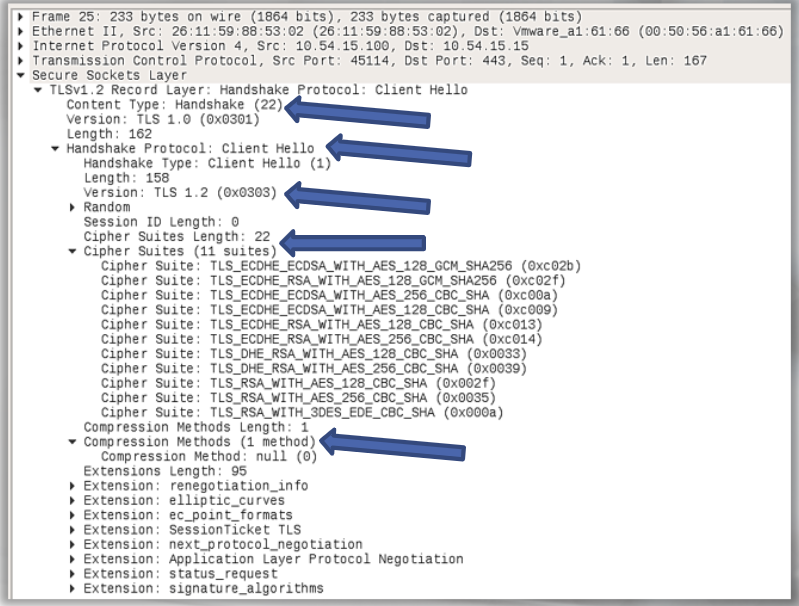
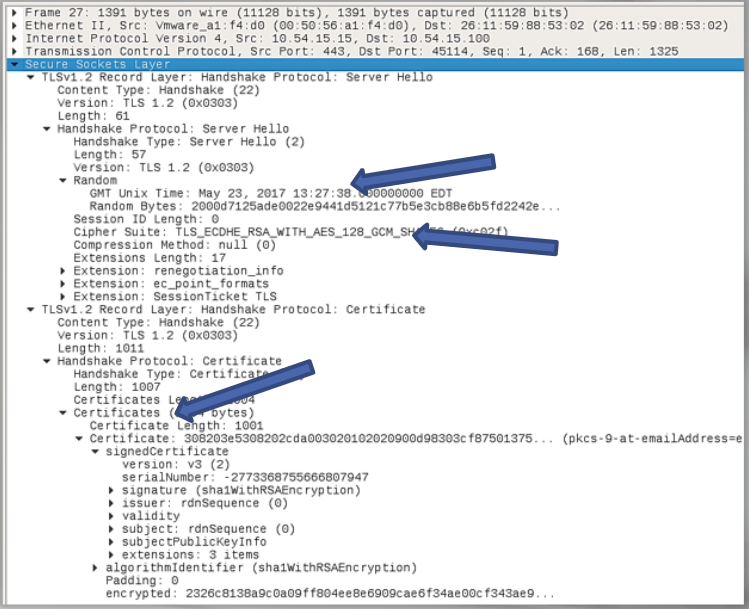
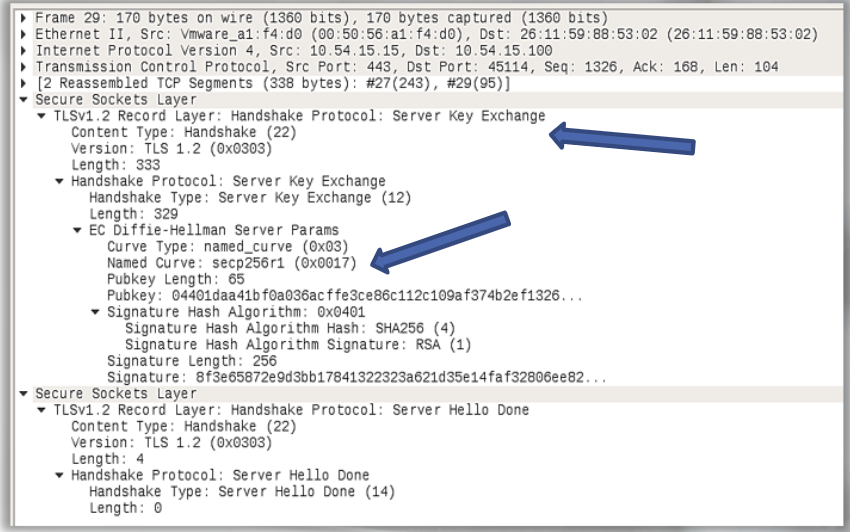
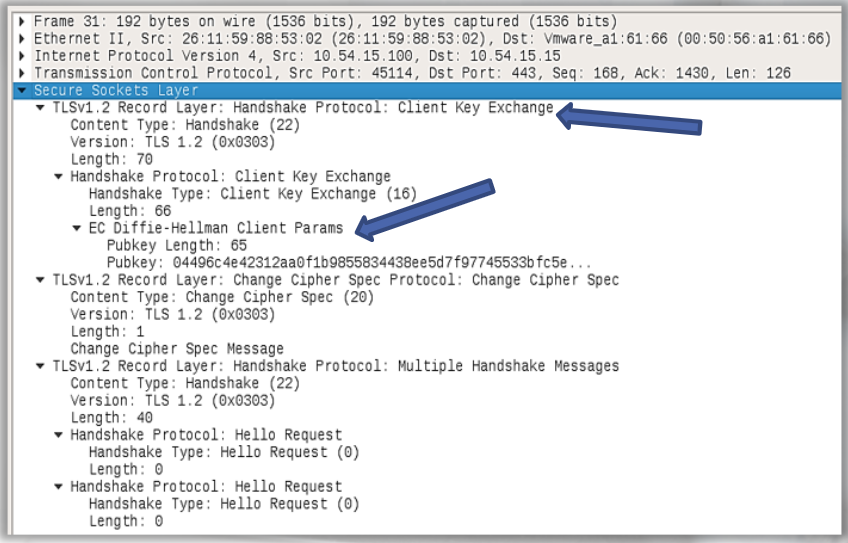
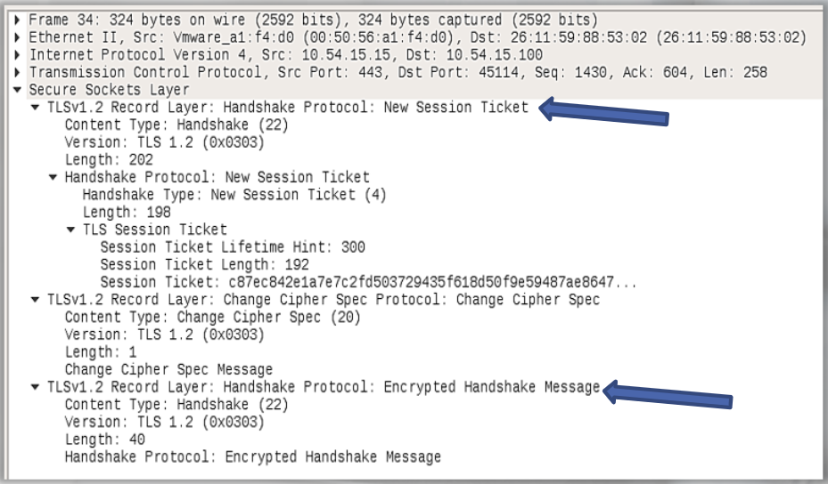
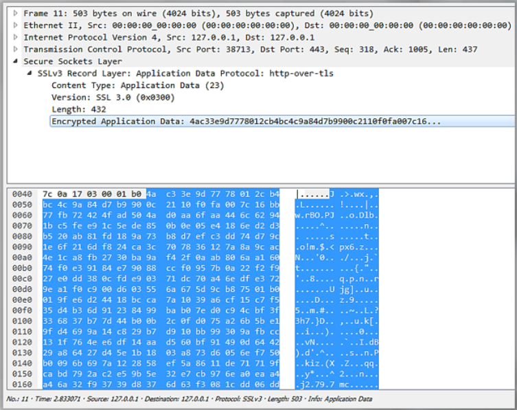
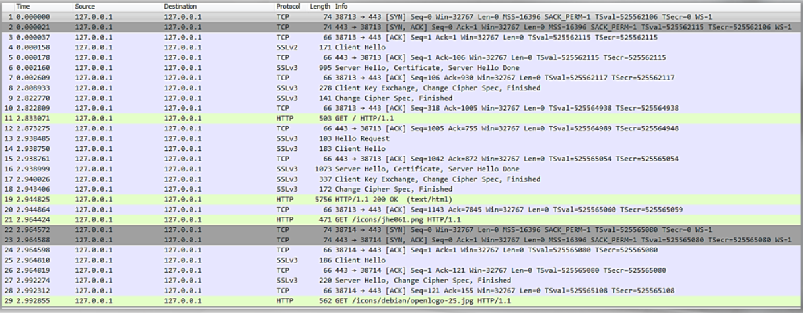

# Normal HTTPS



- SSL portion of the packet is not empty
- Content type = handshake
- handshake protocol: Client Hello
- Version: TLS 1.2
- Cipher Suites (11 suites)
- Compression Method (1 method)

Server's response, server hello packet:






The last packet and the handshake between the server and client is now complete: 



Decrypting SSL encrypted application data: 



```
Edit > preferences > protocols > SSL > Edit (next to RSA keys list)
```

The traffic was decrypted. The decrypted traffic is highlighted in the screenshot in green:



