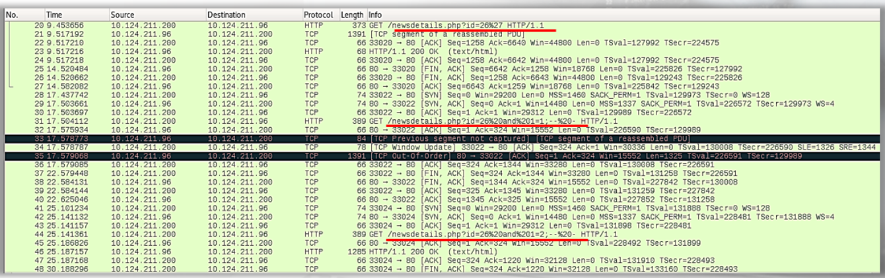

# Suspicious HTTP

Normal HTTP traffic:
- typically port 80
- cleartext web-based traffic
- hosts are accessed using FQDNs instead of IP addresses

The following stands out in the pcap:

- normal requests to web pages, news.php and newsdetails.php?id=26
- request to newsdetails.php?id=26%27
    - URL decode %27 = single quote (')
    - behavior is typical when looking for SQL injection (SQLi)

 

- more attempts at SQLi 

What to do?
- review the packets associated with the SQLi
- determine the User-Agent
- determine what they are doing
- determine if they escalated 
- determine what tools they are using - looks like Sqlmap

Before inspecting the logs pertaining to the web server of interest, we already have a good idea of the source host from which these quieries originated from, 10.124.211.200, which is on the same subnet as the web server. 

We also know that the individual manually tested for SQLi before running Sqlmap against the web server. 

The hunt goes on to find out if this is a malicious employee or someone has infiltrated the network... 