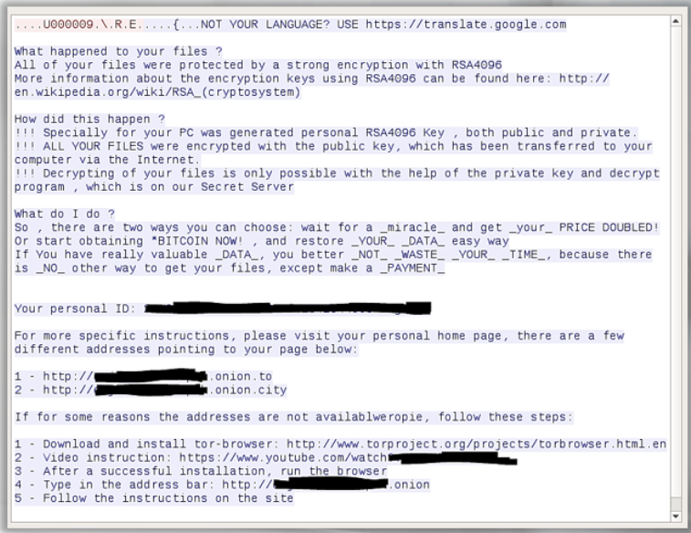
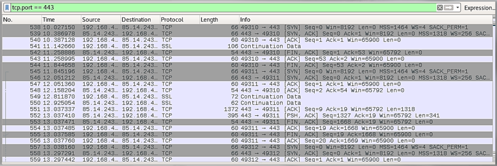
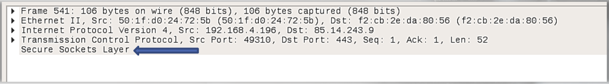

# Suspicious HTTPS

Search suspicious traffic for cleartext traffic:

Zero packets showing SSL/TLS handshake that is required for encrypted communication between both nodes. 

Ensure the SSL field of the packet shouldn't be empty:

