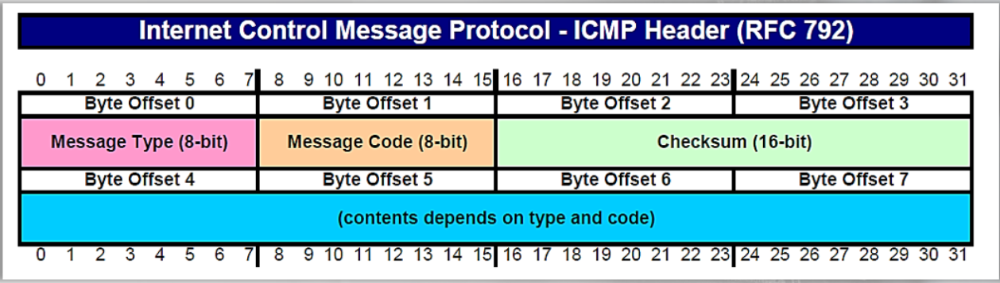
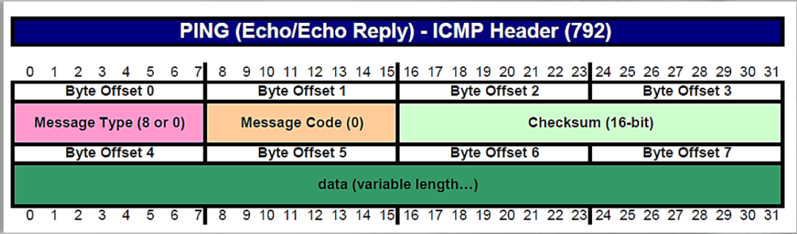

# ICMP (Internet Control Message Protocol)

ICMP provides information regarding different nodes on a network. 
Utilities such as ping and tracert utilize ICMP. 

https://datatracker.ietf.org/doc/html/rfc792

ICMP Header: 

Header for Ping traffic:

