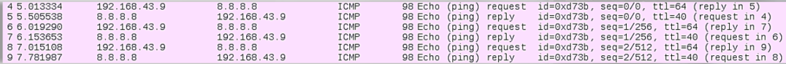
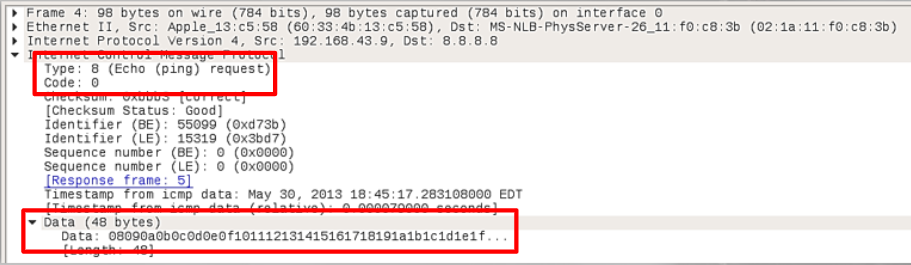
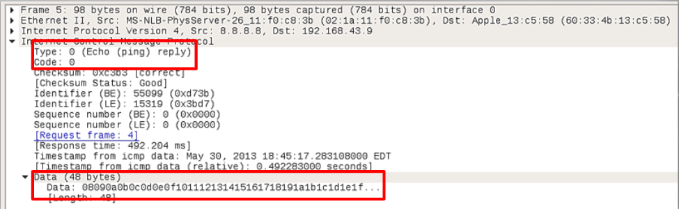

# Normal ICMP

The packet capture below reflects Echo (Ping) Requests and Echo (Ping) Replies:

Packet details for Echo (ping) Request:

Type 8 & Code 0 both indicate that this packet is an echo request. 
Data represents a random text string. 

Packet details for Echo (ping) Reply:

Type 0 and Code 0 both indicate that this packet is an echo reply.
Data should be the same random text string from echo request. 
