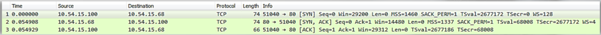
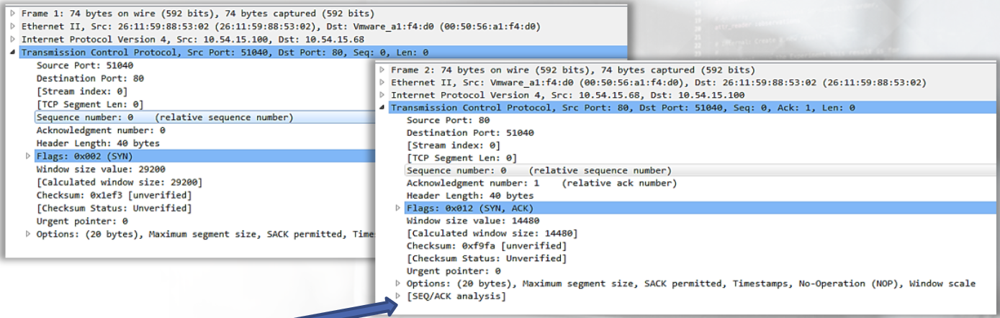
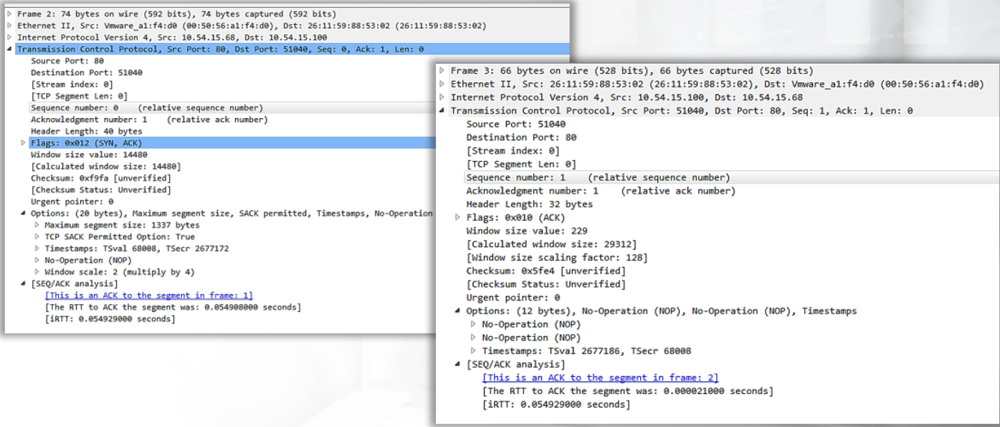
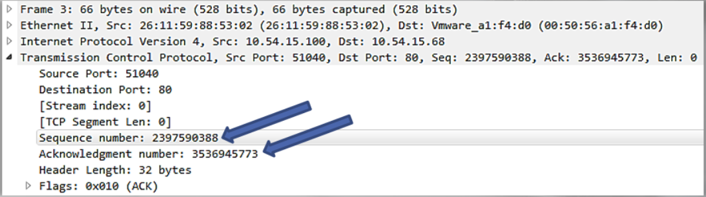

# Normal TCP

Example of a normal TCP 3-way handshake:





All SEQ and ACK numbers always start at 0 for the first packet seen in conversation because that's how Wireshark and TShark does it. 

You can change this by going into Wireshark and:
```
Edit > Preferences > Protocols > TCP > Relative sequence numbers (uncheck box)
```

In order to se the original sequence and acknowledgement numbers:


