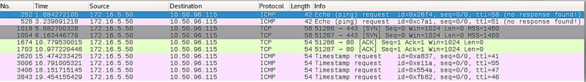
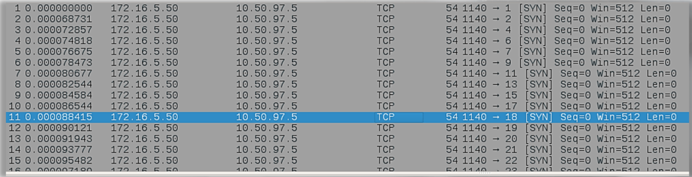
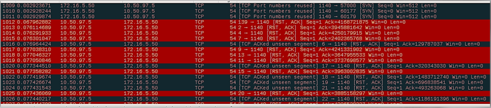
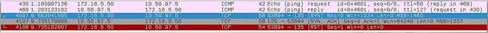

# Suspicious TCP

Below is a snapshot of a ping sweep performed with Nmap.
The sweep used Echo (Ping) Requests and TCP SYN connections to ports 80 & 443.

Timestamp Requests following an Echo (ping) request are suspicious. 

Many TCP SYN packets without the corresponding SYN/ACK packets should raise a flag. Port scan:

Wireshark highlishts strange traffic in colors:

Below is another packet capture of a SYN scan.
The traffic was filtered to focus on a specific node within the noise, 10.50.97.5:

We see the following with the last 3 packets:
- SYN to start communication with 10.50.97.5
- SYN/ACK response which tells us the port is open
- RST to end commincation

