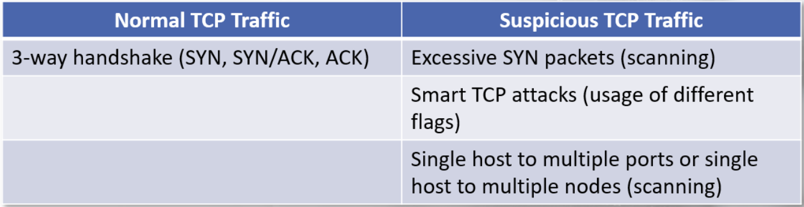

# TCP

TCP (transmission Control Protocol) ensures delivery of data from the source node to the detination node. 
TCP handles sequencing of packets and error recovery. 

Prior to communication, TCP conducts a 3-way handshake between both nodes. 

https://datatracker.ietf.org/doc/html/rfc793

TCP Header: 

3-Way Handshake: 

Facts to help distinguish normal and suspicious TCP traffic:

