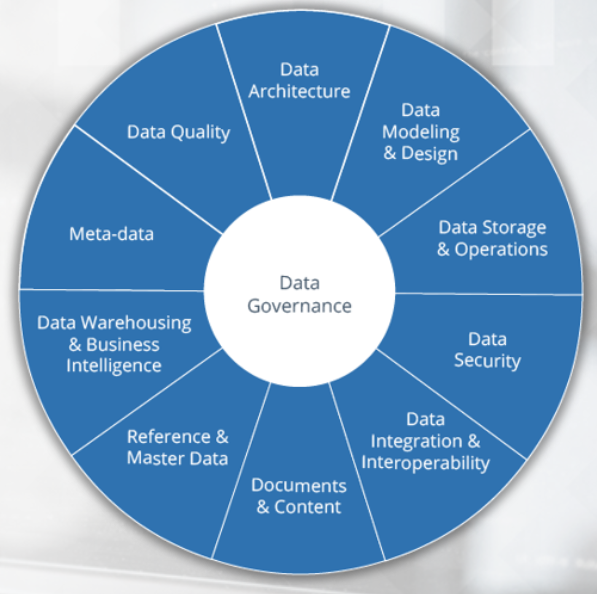

# Data Collection and Analysis

To start hunting, we need to determine what we want to hunt for, based on a hypothesis, and then perform the hunt by looking at the data we have. 

But what is the data that we have?
How do we ensure it is qualified to our needs?
How do we transform and make it useful to us?

Before we hunt, we need to collect data. 
When collecting, we should ensure that we have a purpose based on what we want to find in that data to avoid collecting a mountain of 'noise populated' logs. 

Once we identify what data we exactly want to collect, we need to find a method for exporting that data from the local machines to our analytic software. 

With the exporting method in place, we should be able to conclude our hunting capability and expectations as a bare minimum based on the following: 
- How much of the needed data is available for a hunt? 
- How much of the environment would I cover with the available data during a hunt?
- How far back in time can I search? 
- What about the quality of that data; for example, how consistent is it across the different data sources? How do we govern that? 

### Data Governance
DG is the overall management of the availability, usability, integrity, and security of data used in an enterprise. 

We can define data quality as:
- data completeness - is all required data available and for how long? 
- data consistency - is a standard naming convention applied to data fields from different data sources? 
- data timeliness - do timestamps represent the actual creation time of the events? 

How do we identify anomalies in that data?

First step: understand what is "normal" in the environment. 

Develop a baseline of regular activity that is expected on a golden image of an endpoint and in the network traffic. 
Includes:
- running processes
- user logons -> where, when, and what type of login
- network connections
- services and scheduled tasks
- software that is allowed to execute

### Data Analysis
How do we get the usefule parts of the collected data?

An analysis is usually performed on a SIEM system, such as ELK/HELK, Splunk, Graylog, and many others. 

Analyzing the data means that we are manipulating it by:
- Searching it - gives us the ability to find answers to our questions and help identify anomalies
- Aggregating it - grouping values within the same field together
- Filtering it
- Joining data together