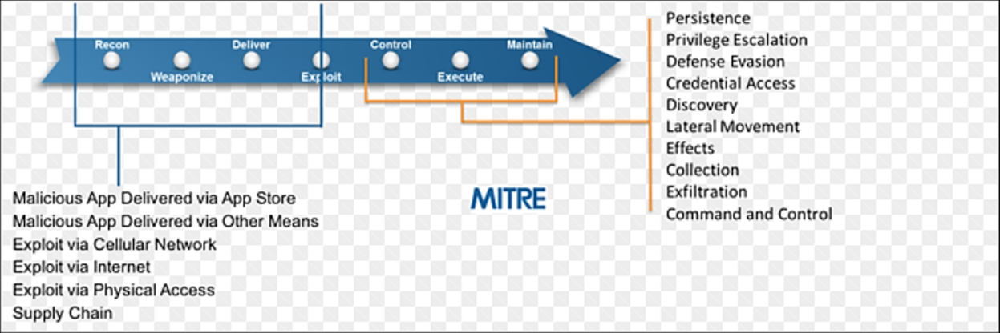

# MITRE ATT&CK

MITRE's Adversarial Tactics, Techniques, and Common Knowledge (ATT&CK) is a curated knowledge base and model for cyber adversary behvaior, reflecting the various phases of an adversary's attack lifecycle and the platforms they are known to target. 

MITRE ATT&CK - Post Exploitation

