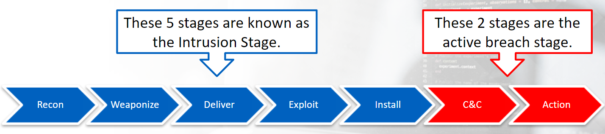

# Cyber Kill Chain Model

### Recon
Involves passive scanning plus Open-Source Intelligence.
It can also involve active scanning of public-facing IPs. 

### Weaponize
This is where the RAT (Remote Access Tool) is added to the exploit. 
The exploit can reside on a web page or a malicious macro-based document attached to an email. 

### Deliver
Covers the delivery of the weaponized tool. 
Few methods for delivery, including via email, social media, or a watering hole attack. 

### Exploit
This phase is the actual exploitation, and this is when a user opens the document attached to an email, clicks a link, etc.
This can be a 2-step process where a loader is used to download the actual RAT. 
The loader will typically be small in size and reside only in memory. 

### Install
Additional tools are installed via the RAT.
Other tools can be a network scanner, a keylogger, etc. 

### Command & Control (C2)
This is when the victim's machine will call out to an IP or domain and provide the adversary command-line remote access to the compromised machine. 

### Action
This is where the goal is achieved. 
The goal can be exfiltration:
- adversary scans the network, looks for/reviews data, and grabs what they are looking for
- what you're trying to protect leaves the network