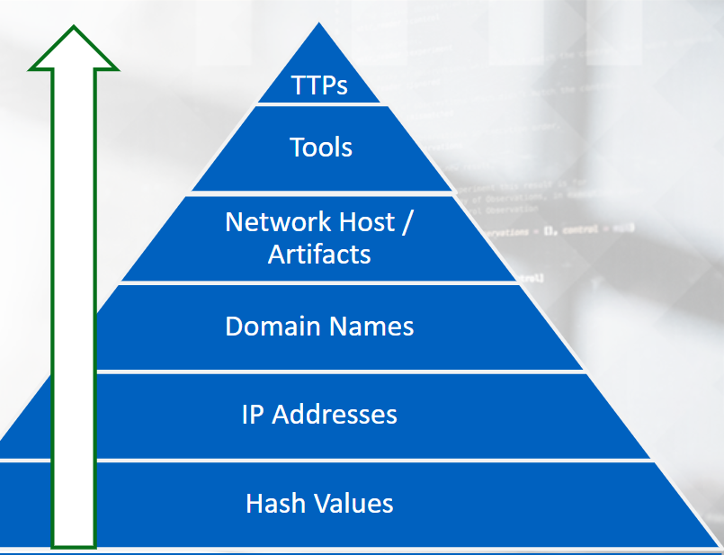
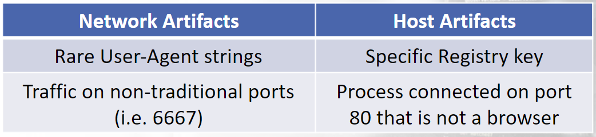

# Pyramid of Pain

Pyramid of Pain, is a visual that will layer the potential usefulness of indicators that will aid you in detecting an adversary. 

As we go up the Pyramid of Pain, the harder it will be to obtain the adversary specific IOSc.

Use the hash value of the binary that was downloaded and compare it to the value on the developer's site; this will confirm the authenticity of the binary you downloaded and verify that it has not been tampered with. 

The probability that an adversary is using some sort of anonymity channel to mask their actual IP address is high. 
By anonymity, we are referring to a proxy, VPN, or TOR, for example. 

IP addresses are easy to change. 

Below is an example of a Network Artifact and a Host Artifact: 

