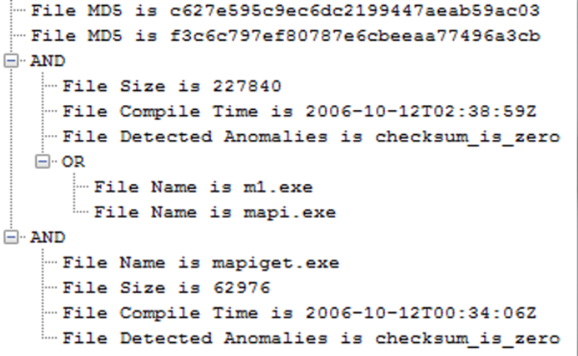

# Tactics, Techniques and Procedures

TTPs tell us the methods the adversary uses to enter the network and how they pivot throughout the network to achieve their goals. 

TTPS will help us identify the adversary in future attacks by creating Indicators of Compromise (IOCs).

IOCs are artifects that were gathered from an active intrusion or previous intrusion that are used to identify a particular adversary. 
- artifacts include MD5 hashes, IP addresses, names of EXEs used, etc. 

APT 1 uses two custom utilities to steal emails from their victims: 
1. GETMAIL: malware used to extract email messages and attachments from Outlook PST files.
2. MAPIGET: malware used to extract email messages and attachments from an Exchange server. 

IOC for GETMAIL: 

IOC for MAPIGET: 

